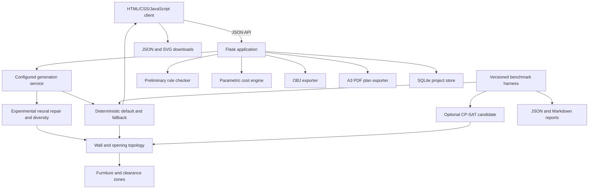

# ArchAI Web Architecture

## Decision

ArchAI v0.2 development preview uses a Flask backend with a plain HTML, CSS, and
JavaScript frontend.
This is a better base than Streamlit for the documented interaction model:

- drag-and-drop plan editing and undo/redo;
- a custom, responsive design interface;
- interactive 3D rendering in the browser;
- stable JSON APIs for future AI workers, mobile clients, or a desktop wrapper;
- SVG, JSON, and OBJ export without a proprietary component system.

Streamlit remains useful for research notebooks and model-evaluation dashboards,
but it is not the product shell.

The term "Java" is interpreted as **JavaScript**, because the requested browser UI
and the source documentation's React.js direction require JavaScript. There is no
JVM or Java runtime in the current architecture. If JVM Java is a separate course
or integration requirement, it should be added as an explicitly scoped service.

## Runtime topology

Phase 1 adds local project persistence through SQLite. It stores a versioned,
validated snapshot of the design brief, all concept results, and the active
concept. Authentication and shared cloud projects remain deferred.

Room rectangles are the geometry source of truth. The topology service splits and
deduplicates their edges into wall segments, builds a connected door graph, adds
an exterior entry and habitable-room windows, and regenerates those references
after every edit. Client-supplied topology is never treated as authoritative.
Furniture-use, door-approach, and turning-circle zones are derived from the same
validated room and opening geometry and rebuilt alongside topology.

Phase 2A adds an offline evaluation boundary around generator candidates. A
candidate accepts a validated `DesignBrief` and returns five `Layout` objects;
the benchmark then applies generator-independent validity, program, adjacency,
diversity, budget, accessibility, and alignment metrics. The benchmark is not
called by user-facing API requests, so it cannot add production latency or make
an evaluation fixture part of a generated project.

Phase 2B adds `cp-sat-v1` only at this offline candidate boundary. OR-Tools is an
optional research dependency and is not installed by the default production
requirements. The solver selects discrete room ordering; existing deterministic
services remain responsible for geometry, semantic topology, zoning, and hard
checks. The user-facing API therefore keeps its existing behavior and latency.

## Modules

| Module | Responsibility |
|---|---|
| `archai/models.py` | Validate the design brief and layout interchange schema |
| `services/layout_generator.py` | Generate five deterministic corridor/perimeter layouts and adjacency metrics |
| `services/solver_generator.py` | Generate five CP-SAT room-order candidates for offline evaluation |
| `services/topology.py` | Derive walls, doors, windows, corridor metadata, and topology issues |
| `services/zoning.py` | Derive furniture-use, door-approach, and accessible turning zones |
| `services/compliance.py` | Check area, boundaries, overlaps, adjacency, daylight potential, and review triggers |
| `services/cost_estimator.py` | Produce an editable concept-stage cost baseline |
| `services/exporter.py` | Convert concept floor geometry to Wavefront OBJ |
| `services/plan_exporter.py` | Render vector A3 concept plan sheets with ReportLab |
| `services/project_store.py` | Validate and persist complete editor projects |
| `database.py` | Manage SQLite connections and forward-only schema migrations |
| `evaluation/dataset.py` | Validate, generate, fingerprint, and load benchmark fixtures |
| `evaluation/benchmark.py` | Evaluate candidate generators and enforce regression gates |
| `evaluation/candidates.py` | Resolve named baseline and research candidate generators |
| `evaluation/comparison.py` | Compare baseline and CP-SAT reports using promotion gates |
| `evaluation/__main__.py` | Produce JSON and Markdown benchmark reports from the CLI |
| `routes.py` | Serve the product UI and versioned API |
| `static/js/app.js` | Survey, SVG editor, history, analysis rendering, and exports |
| `static/js/viewer3d.js` | Dependency-free interactive 3D massing canvas |
| `tests/e2e/archai.spec.js` | Browser workflow and automated WCAG A/AA checks |

## Free-resource policy

The default executable uses only Python, Flask, SQLite, browser-native APIs, Gunicorn, and
the BSD-licensed ReportLab toolkit. Playwright and axe-core are free development
tools used only for quality checks. The application has no paid API, cloud, font,
analytics, or map dependency. Cost rates are local assumptions and cannot be
described as real-time market prices.

OR-Tools is Apache-2.0-licensed and used by the optional solver and repair
research requirements and CI comparisons.

The committed Phase 2A dataset is generated by repository code and contains no
external plans or personal data. External data remains blocked until the dataset
governance checklist is satisfied.

The default database is `instance/archai.sqlite3`. Deployments must set
`ARCHAI_DATABASE` to a writable persistent volume if saved projects must survive
host replacement. SQLite is intentionally local-only at this stage.

Recommended later open-source components:

- CubiCasa5K and other datasets only after license and provenance review;
- Blender for asset cleanup and visual QA;
- IfcOpenShell for IFC/BIM export;
- EnergyPlus for building-energy simulation;
- Leaflet plus an approved OpenStreetMap tile provider or self-hosted tiles;
- WebXR for browser VR.

## Safety boundary

ArchAI is an early-design assistant. A generated layout is not a permit drawing,
structural calculation, fire-safety certificate, accessibility certification, or
professional architectural service. Jurisdiction-specific rules must be versioned,
cited, tested, and reviewed by qualified professionals before release.

## Phase 2C offline data boundary

`archai/datasets/` contains the strict canonical schema, reviewed-source ingestion,
transitive duplicate/building groups, immutable dataset writer/loader, visual QA
and split-selected batch interface. It has no project-store access and adds no
Flask route. See [training-data contract](TRAINING_DATA_PIPELINE.md).

## Phase 2D offline learned-model boundary

`archai_ml/` is an optional package with CPU PyTorch dependencies in
`requirements-ml.txt`. It consumes integrity-checked Phase 2C datasets and creates
program features without observed target geometry. The graph regressor predicts
raw boxes and shared-boundary labels. Training selects a checkpoint on validation;
test scoring is a separate command bound to that dataset and checkpoint digest.

The default application does not import PyTorch. The optional Phase 2F serving
adapter loads the frozen model only when configured by the operator. Raw neural
boxes always pass through repair, topology construction and strict validation.
Dedicated ML CI verifies the optional package independently of backend coverage.
See [training and evaluation](LEARNED_BASELINE.md).

## Phase 2E repair boundary

`archai_ml/repair.py` projects frozen normalized proposals into fixed corridor
slots through CP-SAT room assignment. It performs independent strict geometry,
program, coverage, topology and compliance checks before candidate selection.
Type-matched center distance and geometry fingerprints reject near duplicates
and whole-plan reflections. It returns up to five validated layouts with explicit
shortfall/failure diagnostics. Phase 2F expands this restricted pool when needed
to meet the five-result contract; the Phase 2E module remains a frozen comparator.

`archai_ml/repair_evaluation.py` compares the frozen neural model and a train-only
reference with identical repair settings. It records per-case failures, coordinate
displacement, warm CPU latency, optional fresh-brief stress evidence and immutable
artifacts. The dedicated CI job enforces repair-component validity separately from
full generator release gates. See [repair contract](CONSTRAINT_REPAIR.md).

## Phase 2F experimental serving boundary

`archai_ml/diversity.py` adds bounded corridor-position reflow and compatible-set
selection with the unchanged 0.025 separation threshold. Every output receives
independent geometry/topology validation; reflected or repeated concepts cannot
fill the result set. `archai_ml/qualification.py` binds fresh cohorts and the
frozen model, comparing learned and type-mean proposals under identical processing.

`services/generation_engine.py` reads operator configuration once during app
startup. `archai_ml/inference.py` verifies and caches the frozen checkpoint per
worker, serializes inference and retains no request history. The route validates
all five concepts again before response scoring. Missing dependencies, checkpoint
failure, shortfalls and rejected output trigger the deterministic fallback;
response metadata identifies the engine actually used. Model paths and exceptions
are never exposed in responses. See [configuration and protocol](PHASE2F_PROTOCOL.md).
