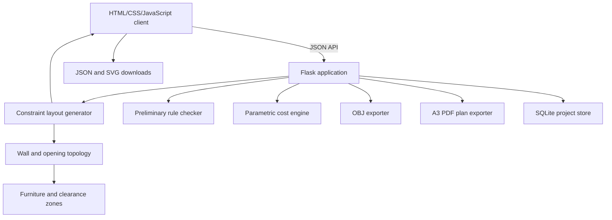

# ArchAI Web Architecture

## Decision

ArchAI v0.1 development preview uses a Flask backend with a plain HTML, CSS, and
JavaScript frontend.
This is a better base than Streamlit for the documented interaction model:

- drag-and-drop plan editing and undo/redo;
- a custom, responsive design interface;
- interactive 3D rendering in the browser;
- stable JSON APIs for future AI workers, mobile clients, or a desktop wrapper;
- SVG, JSON, and OBJ export without a proprietary component system.

Streamlit remains useful for research notebooks and model-evaluation dashboards,
but it is not the product shell.

The term "Java" is interpreted as **JavaScript**, because the requested browser UI
and the source documentation's React.js direction require JavaScript. There is no
JVM or Java runtime in the current architecture. If JVM Java is a separate course
or integration requirement, it should be added as an explicitly scoped service.

## Runtime topology

Phase 1 adds local project persistence through SQLite. It stores a versioned,
validated snapshot of the design brief, all concept results, and the active
concept. Authentication and shared cloud projects remain deferred.

Room rectangles are the geometry source of truth. The topology service splits and
deduplicates their edges into wall segments, builds a connected door graph, adds
an exterior entry and habitable-room windows, and regenerates those references
after every edit. Client-supplied topology is never treated as authoritative.
Furniture-use, door-approach, and turning-circle zones are derived from the same
validated room and opening geometry and rebuilt alongside topology.

## Modules

| Module | Responsibility |
|---|---|
| `archai/models.py` | Validate the design brief and layout interchange schema |
| `services/layout_generator.py` | Generate five deterministic corridor/perimeter layouts and adjacency metrics |
| `services/topology.py` | Derive walls, doors, windows, corridor metadata, and topology issues |
| `services/zoning.py` | Derive furniture-use, door-approach, and accessible turning zones |
| `services/compliance.py` | Check area, boundaries, overlaps, adjacency, daylight potential, and review triggers |
| `services/cost_estimator.py` | Produce an editable concept-stage cost baseline |
| `services/exporter.py` | Convert concept floor geometry to Wavefront OBJ |
| `services/plan_exporter.py` | Render vector A3 concept plan sheets with ReportLab |
| `services/project_store.py` | Validate and persist complete editor projects |
| `database.py` | Manage SQLite connections and forward-only schema migrations |
| `routes.py` | Serve the product UI and versioned API |
| `static/js/app.js` | Survey, SVG editor, history, analysis rendering, and exports |
| `static/js/viewer3d.js` | Dependency-free interactive 3D massing canvas |
| `tests/e2e/archai.spec.js` | Browser workflow and automated WCAG A/AA checks |

## Free-resource policy

The executable uses only Python, Flask, SQLite, browser-native APIs, Gunicorn, and
the BSD-licensed ReportLab toolkit. Playwright and axe-core are free development
tools used only for quality checks. The application has no paid API, cloud, font,
analytics, or map dependency. Cost rates are local assumptions and cannot be
described as real-time market prices.

The default database is `instance/archai.sqlite3`. Deployments must set
`ARCHAI_DATABASE` to a writable persistent volume if saved projects must survive
host replacement. SQLite is intentionally local-only at this stage.

Recommended later open-source components:

- PyTorch for evaluated ML experiments;
- CubiCasa5K and other datasets only after license and provenance review;
- Blender for asset cleanup and visual QA;
- IfcOpenShell for IFC/BIM export;
- EnergyPlus for building-energy simulation;
- Leaflet plus an approved OpenStreetMap tile provider or self-hosted tiles;
- WebXR for browser VR.

## Safety boundary

ArchAI is an early-design assistant. A generated layout is not a permit drawing,
structural calculation, fire-safety certificate, accessibility certification, or
professional architectural service. Jurisdiction-specific rules must be versioned,
cited, tested, and reviewed by qualified professionals before release.
