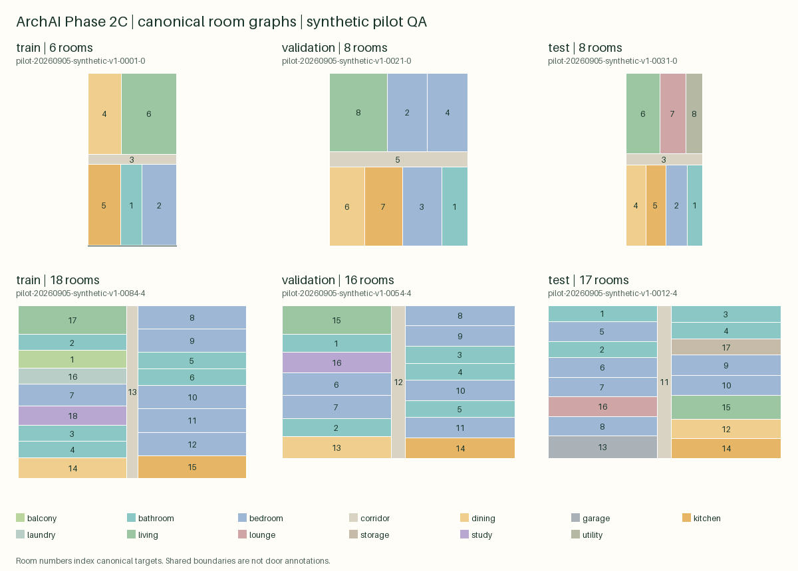

# Phase 2C dataset report

Source: `archai-synthetic-roomgraphs-v1` version `1`; origin: synthetic; license: MIT. Full provenance and admission evidence are in [source manifest](phase2c-source.json).

Accepted plans: 592; exact duplicates removed: 8; rejected: 0.

| Split | Plans |
|---|---:|
| train | 477 |
| validation | 55 |
| test | 60 |

Building/duplicate groups: 120.

Only rectangular rooms in metres are supported. Adjacency means a shared boundary of at least 0.8 m; it does not establish a door or accessible route. Edge clusters spanning at most 2 mm are consolidated before validation. Coarse duplicate buckets can miss near copies across rounding boundaries. Synthetic pilot performance does not establish real-plan generalization.

Records SHA-256: `e0efc4064fec21e0ca430ae356705052ba6002c70908fc3470606ddc944fd9aa`

